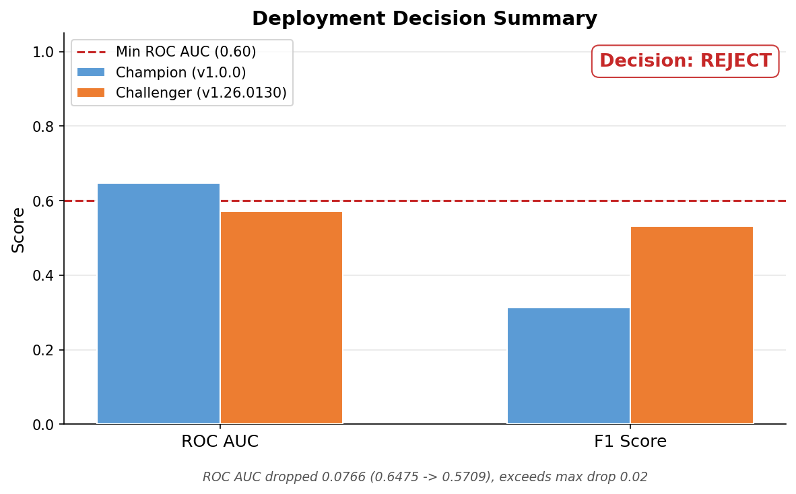
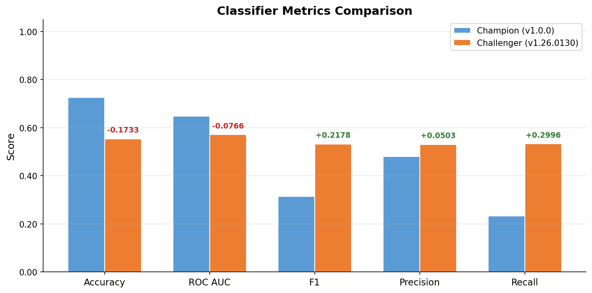
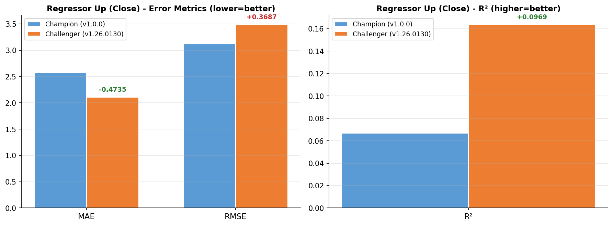
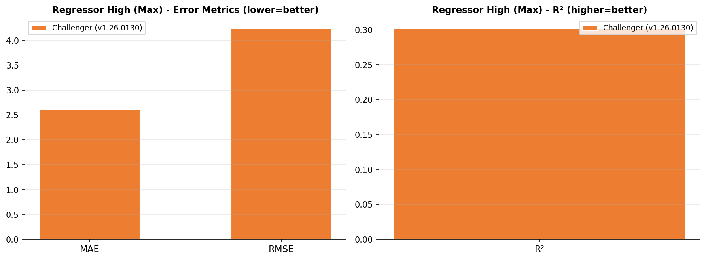
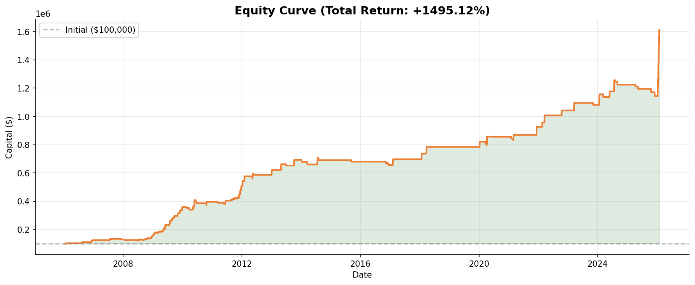
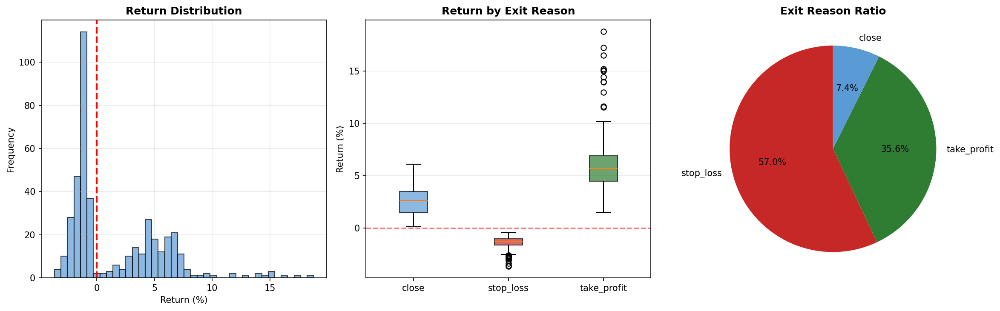

# Model Retraining Report - v1.26.0130

- **Generated**: 2026-01-30 23:43:35
- **Trigger**: local_test
- **Duration**: 241.7s (4.0min)
- **Status**: REJECTED

---
## 1. Training Data

| Item | Value |
|------|-------|
| Samples | 114,185 |
| Date Range | 2006-01-17 ~ 2026-01-30 |

## 2. Hyperparameters

| Parameter | Value |
|-----------|-------|
| threshold | 0.4 |
| n_estimators | 300 |
| test_size | 0.1 |
| valid_size | 0.2 |

---
## 3. Test Metrics

### Model 1: Classifier (Direction)

| Metric | Value |
|--------|-------|
| accuracy | 0.5532 |
| roc_auc | 0.5709 |
| f1_score | 0.5315 |
| precision | 0.5305 |
| recall | 0.5326 |

### Model 2: Regressor Up (Close Return)

| Metric | Value |
|--------|-------|
| mae | 2.1039 |
| rmse | 3.4876 |
| r2 | 0.1637 |

### Model 2-1: Regressor High (Max Return)

| Metric | Value |
|--------|-------|
| mae | 2.6176 |
| rmse | 4.2413 |
| r2 | 0.3023 |

### Model 3: Regressor Down (Loss)

| Metric | Value |
|--------|-------|
| mae | 1.1834 |
| rmse | 1.8316 |
| r2 | 0.3657 |

---
## 4. Champion-Challenger Comparison

| | Champion (v1.0.0) | Challenger (v1.26.0130) | Delta |
|---|---|---|---|
| ROC AUC | 0.6475 | 0.5709 | -0.0766 |
| F1 Score | 0.3137 | 0.5315 | +0.2178 |

**Decision**: `REJECT`

**Reason**: ROC AUC dropped 0.0766 (0.6475 -> 0.5709), exceeds max drop 0.02

---
## 5. Backtest Results

| Metric | Value |
|--------|-------|
| Total Return | +1495.12% |
| CAGR | +14.82% |
| Sharpe Ratio | 1.414 |
| Sortino Ratio | 1.476 |
| Max Drawdown | -8.93% |
| Win Rate | 42.52% |
| Profit Factor | 3.097 |
| Trades | 421 |
| Expectancy | $3,551.35 |

### Exit Reason Breakdown

| Reason | Count | Avg Return |
|--------|-------|------------|
| stop_loss | 240 (57.0%) | -1.39% |
| take_profit | 150 (35.6%) | +6.23% |
| close | 31 (7.4%) | +2.57% |

---
## 6. Artifacts

- **Model**: `models/stacking/v1.26.0130/stacking_hybrid_model.pkl`
- **Report**: `models/stacking/v1.26.0130/report.md`
- **Charts**: `decision_summary.png`, `classifier_comparison.png`, `regressor_up_comparison.png`, `regressor_high_comparison.png`, `regressor_down_comparison.png`, `equity_curve.png`, `trade_analysis.png`
