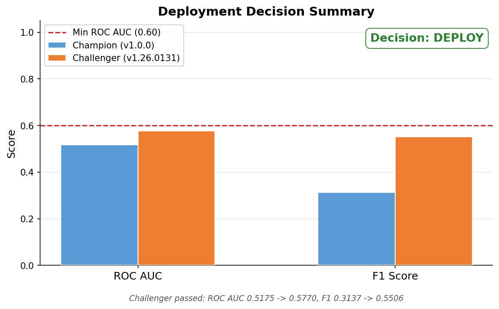
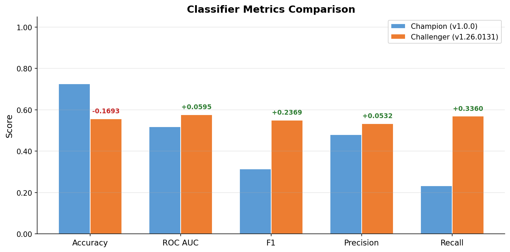
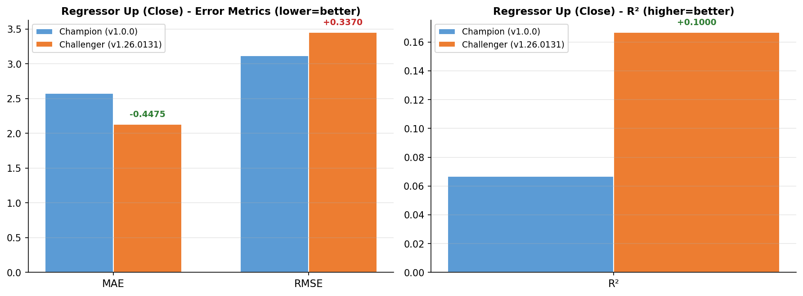
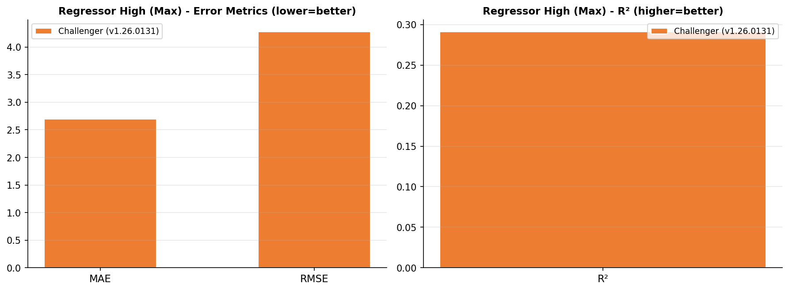
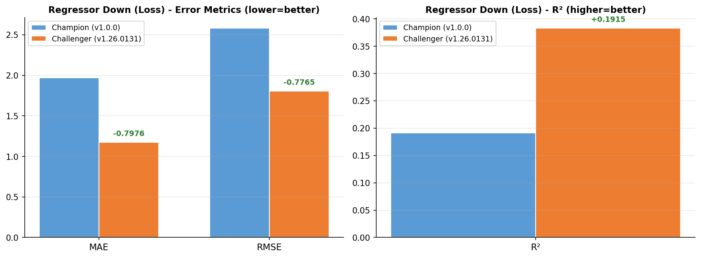
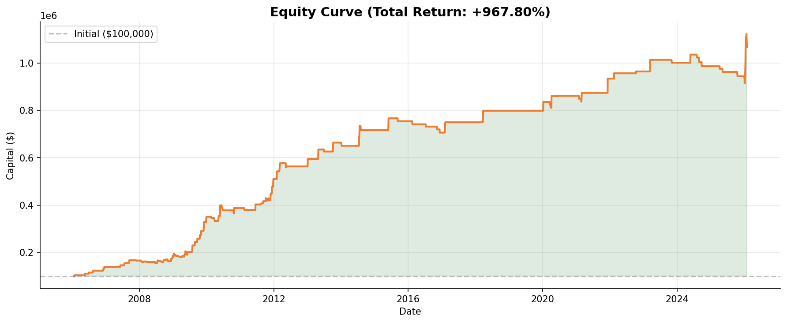
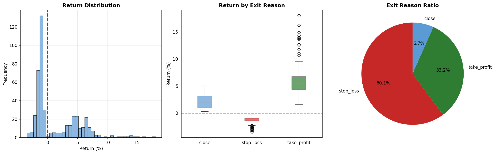

# Model Retraining Report - v1.26.0131

- **Generated**: 2026-01-31 00:27:48
- **Trigger**: local_test
- **Duration**: 246.0s (4.1min)
- **Status**: DEPLOYED

---
## 1. Training Data

| Item | Value |
|------|-------|
| Samples | 114,185 |
| Date Range | 2006-01-17 ~ 2026-01-30 |

## 2. Hyperparameters

| Parameter | Value |
|-----------|-------|
| threshold | 0.4 |
| n_estimators | 300 |
| test_size | 0.1 |
| valid_size | 0.2 |

---
## 3. Test Metrics

### Model 1: Classifier (Direction)

| Metric | Value |
|--------|-------|
| accuracy | 0.5572 |
| roc_auc | 0.5770 |
| f1_score | 0.5506 |
| precision | 0.5334 |
| recall | 0.5690 |

### Model 2: Regressor Up (Close Return)

| Metric | Value |
|--------|-------|
| mae | 2.1299 |
| rmse | 3.4559 |
| r2 | 0.1668 |

### Model 2-1: Regressor High (Max Return)

| Metric | Value |
|--------|-------|
| mae | 2.6952 |
| rmse | 4.2788 |
| r2 | 0.2912 |

### Model 3: Regressor Down (Loss)

| Metric | Value |
|--------|-------|
| mae | 1.1733 |
| rmse | 1.8061 |
| r2 | 0.3832 |

---
## 4. Champion-Challenger Comparison

| | Champion (v1.0.0) | Challenger (v1.26.0131) | Delta |
|---|---|---|---|
| ROC AUC | 0.5175 | 0.5770 | +0.0595 |
| F1 Score | 0.3137 | 0.5506 | +0.2369 |

**Decision**: `DEPLOY`

**Reason**: Challenger passed: ROC AUC 0.5175 -> 0.5770, F1 0.3137 -> 0.5506

### Deployment Criteria Checklist

| Criteria | Threshold | Actual | Result |
|----------|-----------|--------|--------|
| ROC AUC >= 0.55 | 0.55 | 0.5770 | ✅ PASS |
| Backtest Return >= 0% | 0.00% | +967.80% | ✅ PASS |
| Sharpe Ratio >= 1.0 | 1.000 | 1.237 | ✅ PASS |
| Profit Factor >= 1.0 | 1.000 | 2.411 | ✅ PASS |

---
## 5. Backtest Results

| Metric | Value |
|--------|-------|
| Total Return | +967.80% |
| CAGR | +12.55% |
| Sharpe Ratio | 1.237 |
| Sortino Ratio | 1.229 |
| Max Drawdown | -11.72% |
| Win Rate | 39.87% |
| Profit Factor | 2.411 |
| Trades | 449 |
| Expectancy | $2,155.47 |

### Exit Reason Breakdown

| Reason | Count | Avg Return |
|--------|-------|------------|
| stop_loss | 270 (60.1%) | -1.31% |
| take_profit | 149 (33.2%) | +6.03% |
| close | 30 (6.7%) | +2.05% |

---
## 6. Artifacts

- **Model**: `models/stacking/v1.26.0131/stacking_hybrid_model.pkl`
- **Report**: `models/stacking/v1.26.0131/report.md`
- **Charts**: `decision_summary.png`, `classifier_comparison.png`, `regressor_up_comparison.png`, `regressor_high_comparison.png`, `regressor_down_comparison.png`, `equity_curve.png`, `trade_analysis.png`
- **Active Symlink**: `./models/stacking/active` -> `v1.26.0131/`
